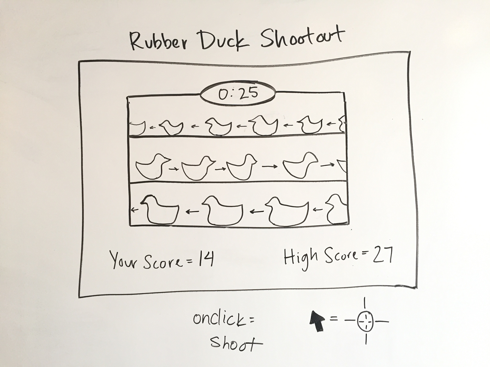

# Rubber Duck Chomp Project

## Overview

For project #1, I created a game of Rubber Duck Chomp.

The user clicks the 'start' button to begin game. The objective is to chomp (click on) as many ducks as possible in 30 seconds. The user earns one point per duck chomped. When time expires, a score alert is displayed with the user's final score.

**Live site:** <https://kathrynmwood.github.io/Rubber-Duck-Chomp/>

## Technologies Used

- Languages - HTML5, CSS3, Javascript
- Design - Google Fonts, Adobe Illustrator
- Sound - MP3
- Project Planning & User Stories - [Trello](https://trello.com/b/L4hLFyAY/wdi-project-1)
- Text Editor - Atom 1.12.4

## Features

- Begin Game Button
- CSS3 Animation
- Scoreboard
- Timer
- Reset Game Button

## Wireframe

## Future Development

- Make it responsive
- Store highest score from multiple sessions
- Optimize images
